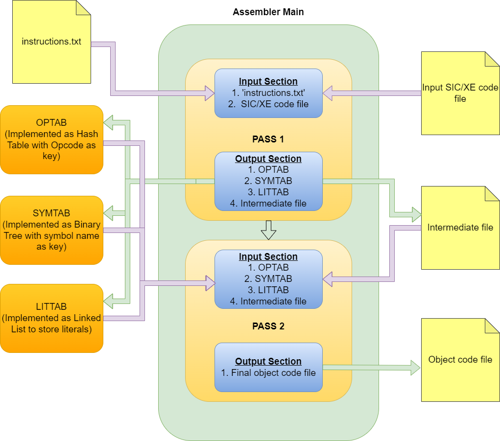

# TWO PASS SIC/XE ASSEMBLER

## Brief Overview

- SIC Machine Extended Edition
- more info on [wikipedia](https://en.wikipedia.org/wiki/Simplified_Instructional_Computer)

## Features implemented

- Addressing Mode (Flag bit)
  - Direct Addressing Mode
  - Indirect Addressing Mode
  - Immediate Addressing Mode
  - Relative Addressing Mode
    - Program Counter (PC Register)
    - Base (Base Register)
  - Simple Addressing Mode
- Extended Instruction (Format 4)
- Literals
- Assembler directives like START, END, BYTE, WORD, EQU etc
- Comments

## Data Structures Used

- Hash Table for OPTAB
- Binary Search Tree for SYMTAB
- Linked List for LITTAB

## Algorithm :

- Pass 1
  - Assign LOCCTR values to all labels
  - Save symbols in SYMTAB and literals in LITTAB
  - Process directives
- Pass 2
  - Prepare listing file (\*.txt)
  - Get opcode from OPTAB
  - Get symbol value from SYMTAB
  - Convert constant defined by BYTE and WORD to object code
  - Write object code to \*.o file

## Instructions to Use :

Source file - test.asm contains

```
TEST    START  0
FIRST   LDT    #1
        LDS    #10
        +JSUB  RDREC
        +JSUB  WRREC
LENGTH  RESW   1

.
. Subroutine for Read Record
.
RDREC   CLEAR  A
RLOOP   TD     INPUT
        JEQ    RLOOP
        RD     INPUT
        COMPR  A,T
        JLT    RLOOP
        COMPR  A,S
        JGT    RLOOP
        STA    LENGTH
        RSUB
INPUT   BYTE   X'F1'

.
. Subroutine for Write Record
.
WRREC   LDX    #0
        LDS    #1
        LDA    #0
        LDT    LENGTH
WLOOP   TD     OUTPUT
        JEQ    WLOOP
        WD     OUTPUT
        ADDR   S,A
        STA    VALUE1
        STS    VALUE2
        LDA    VALUE2
        LDS    VALUE1
        TIXR   T
        JLT    WLOOP
        RSUB

OUTPUT  BYTE   X'05'
VALUE1  RESW   1
VALUE2  RESW   1
        END    FIRST
```

Enter the following commands in terminal.

```sh
$ javac Assembler/Main.java
$ java Assembler.Main test.asm
```

Generates object code in test.o,

```
*********** PASS 1 ***********

> Intermediate File : test.int
00000   TEST        START               0
00000   FIRST       LDT                 #1
00003               LDS                 #10
00006               +JSUB               RDREC
0000A               +JSUB               WRREC
0000E   LENGTH      RESW                1
00011   RDREC       CLEAR               A
00013   RLOOP       TD                  INPUT
00016               JEQ                 RLOOP
00019               RD                  INPUT
0001C               COMPR               A,T
0001E               JLT                 RLOOP
00021               COMPR               A,S
00023               JGT                 RLOOP
00026               STA                 LENGTH
00029               RSUB
0002C   INPUT       BYTE                X'F1'
0002D   WRREC       LDX                 #0
00030               LDS                 #1
00033               LDA                 #0
00036               LDT                 LENGTH
00039   WLOOP       TD                  OUTPUT
0003C               JEQ                 WLOOP
0003F               WD                  OUTPUT
00042               ADDR                S,A
00044               STA                 VALUE1
00047               STS                 VALUE2
0004A               LDA                 VALUE2
0004D               LDS                 VALUE1
00050               TIXR                T
00052               JLT                 WLOOP
00055               RSUB
00058   OUTPUT      BYTE                X'05'
00059   VALUE1      RESW                1
0005C   VALUE2      RESW                1
0005F               END                 FIRST

> Symbol Table
Symbol		    Value
FIRST           00000
INPUT           0002C
LENGTH          0000E
OUTPUT          00058
RDREC           00011
RLOOP           00013
TEST            00000
VALUE1          00059
VALUE2          0005C
WLOOP           00039
WRREC           0002D


*********** PASS 2 ***********

> Listing File: test.txt
00000   TEST        START               0
00000   FIRST       LDT                 #1                  750001
00003               LDS                 #10                 6D000A
00006               +JSUB               RDREC               4B100011
0000A               +JSUB               WRREC               4B10002D
0000E   LENGTH      RESW                1
00011   RDREC       CLEAR               A                   B700
00013   RLOOP       TD                  INPUT               E32016
00016               JEQ                 RLOOP               332FFA
00019               RD                  INPUT               DB2010
0001C               COMPR               A,T                 A305
0001E               JLT                 RLOOP               3B2FF2
00021               COMPR               A,S                 A304
00023               JGT                 RLOOP               372FED
00026               STA                 LENGTH              0F2FE5
00029               RSUB                                    4F0000
0002C   INPUT       BYTE                X'F1'               F1
0002D   WRREC       LDX                 #0                  050000
00030               LDS                 #1                  6D0001
00033               LDA                 #0                  010000
00036               LDT                 LENGTH              772FD5
00039   WLOOP       TD                  OUTPUT              E3201C
0003C               JEQ                 WLOOP               332FFA
0003F               WD                  OUTPUT              DF2016
00042               ADDR                S,A                 9340
00044               STA                 VALUE1              0F2012
00047               STS                 VALUE2              7F2012
0004A               LDA                 VALUE2              03200F
0004D               LDS                 VALUE1              6F2009
00050               TIXR                T                   BB50
00052               JLT                 WLOOP               3B2FE4
00055               RSUB                                    4F0000
00058   OUTPUT      BYTE                X'05'               05
00059   VALUE1      RESW                1
0005C   VALUE2      RESW                1
0005F               END                 FIRST

> Object Code : test.o
H^TEST^000000^00005F
T^000000^0E^750001^6D000A^4B100011^4B10002D
T^000011^1B^B700^E32016^332FFA^DB2010^A305^3B2FF2^A304^372FED^0F2FE5^4F0000
T^00002C^1B^F1^050000^6D0001^010000^772FD5^E3201C^332FFA^DF2016^9340^0F2012
T^000047^12^7F2012^03200F^6F2009^BB50^3B2FE4^4F0000^05
M^000007^05^+TEST
M^00000B^05^+TEST
E^000000
```

Pass 1 errors (if any) will be displayed in terminal.
Pass 2 errors (if any) will be displayed in listing file (test.txt here).

## Errors Handled:

- Duplicate Symbol
- Invalid Opcode
- Symbol Not Found
- Address does not fit in Object Code

## Flow Diagram:

